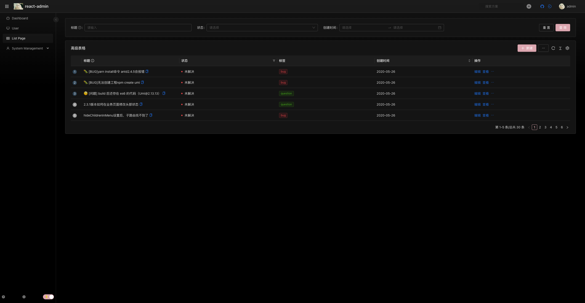

# react admin [react - ts - vite - template]

# 一个`React`+`Monorepo`搭建的后台管理模板「admin template」，在线预览https://hzdjs.cn/react-admin-vite-antd5

## 支持`vite`生成动态路由，支持路由`keepalive`功能

## 代码简介，致力打造成一个标准的模版，可直接用于生产环境开发

#演示

- https://hzdjs.cn/react-admin-vite-antd5
- 账户 admin/user， 密码 任意密码
- 登录
  
- 首页
  
- 暗黑主题
  

# `Monorepo` 管理项目

## 为什么使用

随着研发代码的增多, 工程日益复杂，代码复用和版本管理显得格外的繁琐，版本升级没有日志，相互依赖的包需要手动管理版本，以往的组件库独立开发的方式并没有很好的区分组件和组件之间的关系，往往只需要一种类型的组件，例如图表，但还是不得不安装一整个组件库，并没有很好的对组件进行区分，如哪些是图表组件，哪些是功能组件，哪些是业务组件等，造成组件库越来越大，编译打包效率降低，每次一个小改动就不得不直接发布一整个包预览效果，且无法支持本地调试等以下相关痛点

- 组件耦合严重，组件代码量大
- 业务开发分工不明确，业务开发人员要关心非业务的代码
- 编译慢，效率低
- 无法对应用做增量编译&增量部署
- 相关包基础依赖可能会重复打包，如： `lodash`,`moment`...
- 管理、调试、追踪 `bug` 困难
- 不同项目之间 `node`、`node-sass`、`webpack` 等基础依赖版本不统一，切换增加心智负担
- 不同项目可能存在技术栈不统一，如：状态管理，`less`,`sass`
- 分支管理混乱
- 多包多项目之间依赖关系复杂
- 第三方依赖库版本可能不一致
- 占用总空间大
- 不利于团队协作
- 无法针对主应用统一跑测试用例,发布时很难避免一些基本的错误发生
- 需要频繁切换项目
- 搭建独立的文档系统和其他子应用时，相关依赖又要单独管理，又有上述的症状
  针对上述问题我们引入了 `Monorepo` 的概念，把以往的单一组件库拆分为职责更细化的包，架构更清晰，解耦，子应用隔离
- 我们所有的包管理都强制使用[pnpm](https://pnpm.io/zh/motivation)，在 `monorepo` 架构之上，`pnpm` 能极大发挥他的作用(设计初期就很好的考虑了当前复杂项目的痛点)，相比 `yarn` 和 `npm`，`pnpm` 能节约磁盘空间并提升安装速度，切避免了关于深度嵌套包的一些意外情况，如果你还没有接触了解过 `pnpm`,可以看看[相关文章](https://zhuanlan.zhihu.com/p/377593512), 而且当前已有众多[前端团队](https://pnpm.io/zh/users)和大部分主流开源项目抛弃 `npm`,`yarn`，开始接入 `pnpm`
- [精读《Monorepo 的优势》](https://zhuanlan.zhihu.com/p/65533186)
- [现代化前端应用为什么越来越离不开 Monorepo](https://juejin.cn/post/6944877410827370504)
- [参考](https://turbo.build/repo/docs/core-concepts/monorepos)

## 子应用

- 单独部署
- 单独开发
- 相当于微前端
- 开发中...

## 相关技术栈

- `react`，`react18`，`vite`，`vite3`，`antd`，`antd5.x`，`ts`，`typescript`，`redux`，`react-redux`，`@reduxjs/toolkit`
- [Monorepo](https://turbo.build/repo/docs)
- [ReactJS](https://reactjs.org)
- [Vite](https://vitejs.dev)
- [TypeScript](https://www.typescriptlang.org)
- [Antd5](https://ant.design)
- [ProComponents](https://procomponents.ant.design)
- [Redux](https://react-redux.js.org)
- [Redux-toolkit](https://redux-toolkit.js.org)
- [ESLint](https://eslint.org)
- [Prettier](https://prettier.io)

## 环境

- nodejs >= 16
- npm
- pnpm

### pnpm 相关命令 [pnpm](https://www.pnpm.cn/cli/add)

- pnpm add sax 保存到 dependencies 配置项下
- pnpm add -D sax 保存到 devDependencies 配置项下
- pnpm add -O sax 保存到 optionalDependencies 配置项下
- pnpm add -g sax 安装软件包到全局环境中
- pnpm add sax@next 安装标记为 next 的版本
- pnpm add sax@3.0.0 安装指定版本 3.0.0

### 推荐使用 webstrom vscode 开发

### 代码目录结构

- 使用库生成 `treer`
- 生成 `treer -e ./result.txt -i '/node_modules|.git/'`

```markdown
react-admin-vite-antd5
├─packages // 公共包存放路径
| ├─utils // 公共工具
| ├─ui // ui 组件库
| ├─store // 全局状态管理
| ├─hooks // 公共 hooks
| ├─eslint-config-custom // 全局 eslint
| ├─components // 公共业务组件
├─apps // 项目存放路径
| ├─demo // 示例项目
| ├─admin // 后台管理 app
| | ├─src // 主文件
| | | ├─routes // 路由
| | | ├─pages // 页面
| | | ├─components // 组件
| | | ├─common // 公共资源
| | | ├─assets 静态资源
| | ├─react-admin-vite-antd5 // 打包出口
├─.husky // 代码提交脚本
```

### 包划分

- [components](components) 存放功能性组件，更偏向系统功能，比如`Layout`公共布局组件
- [eslint-config-custom](eslint-config-custom) `eslint`统一管理，所有`package`统一引入
- [hooks](hooks) 自定义`react hooks`，比如`KeepAlive`
- [store](store) 全局状态管理器，封装了`redux`，`store`树，提供`useSelector`，`useDispatch`
- [tsconfig](tsconfig) ts 配置文件，有`base.json`，`vite.json`
- [ui](ui) `ui`组件和`components`不一样的地方就是`ui`只专注纯组件开发，不带业务
- [utils](utils) 工具库，常用的工具函数

### 开始

1. 创建项目
   ```bash
   git clone https://github.com/frontend-winter/react-admin-vite-antd5
   ```
2. 访问项目目录
   ```bash
   cd react-admin-vite-antd5
   ```
3. git 初始化项目
   ```bash
   git init
   ```
4. 安装依赖包
   ```bash
   pnpm install
   ```
5. 启动项目，访问链接：http://localhost:5793
   ```bash
   pnpm run dev
   ```

### 发布

- 生产环境打包
  ```bash
  pnpm build
  ```
- 测试环境打包
  ```bash
  pnpm build:sit
  ```

### 推荐使用`nginx`部署

- config 如下

```bash
# 后台管理模板
location ^~ /react-admin-vite-antd5{
  index index.html;

  if ($request_uri ~* .*[.](js|css|map|jpg|png|svg|ico)$) {
    #设置过期时间120秒，120秒过后向服务器重新请求数据
    add_header Cache-Control max-age=120;
  }

  if ($request_filename ~* ^.*[.](html|htm)$) {
    add_header Cache-Control "public, no-cache";
    #html文件协商缓存，也就是每次都询问服务器，浏览器本地是是否是最新的，是最新的就直接用，非最新的服务器就会返回最新
  }


  try_files $uri $uri/ /react-admin-vite-antd5/index.html;
}
```

### 校验代码 格式化代码

- 提交代码自动执行

```bash
pnpm run lint && pnpm run format
```

### 提交格式

- `feat`: 新增功能
- `fix`: 修复 bug
- `docs`: 仅仅修改了文档，比如 README, CHANGELOG 等等
- `test`: 增加/修改测试用例，包括单元测试、集成测试等
- `style`: 修改了空行、缩进格式、引用包排序等等（不改变代码逻辑）
- `perf`: 优化相关内容，比如提升性能、体验、算法等
- `refactor`: 代码重构，「没有新功能或者 bug 修复」
- `chore`: 改变构建流程、或者增加依赖库、工具等
- `revert`: 回滚到上一个版本
- `merge`: 代码合并

## License

This project is licensed under the MIT License. .

## juejin

https://juejin.cn/post/7195496297151168573
